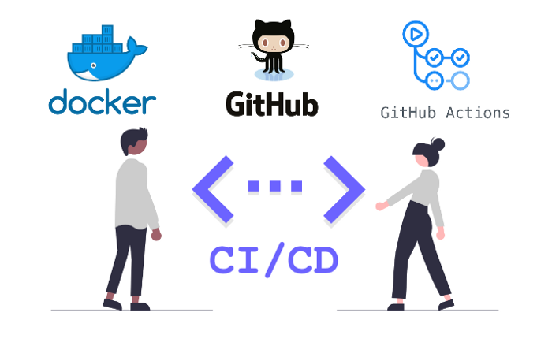
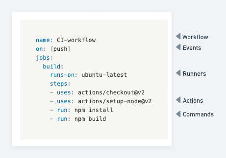
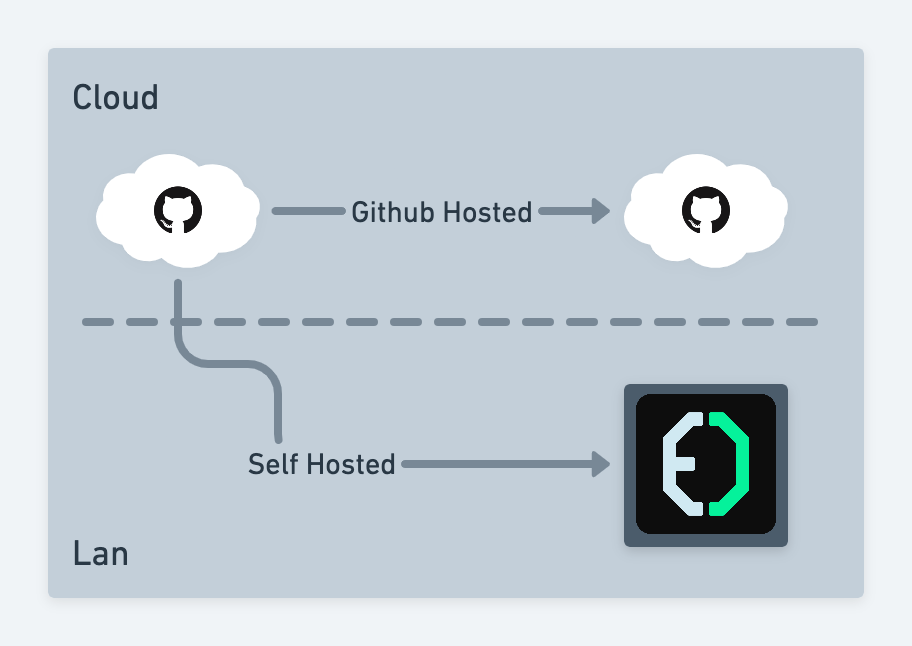
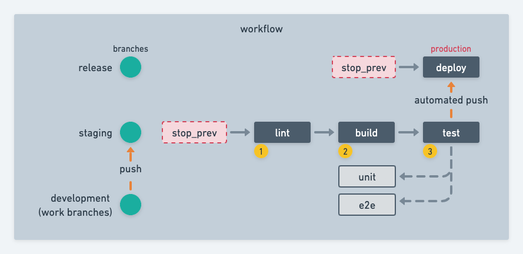
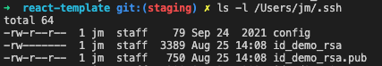

# React template with CI

[](https://github.com/emeraldigital/react-template/actions/workflows/integration.yml)

[](https://github.com/emeraldigital/react-template/actions/workflows/deployment.yml)

## Objetivo

Aprender cómo automatizar el flujo de integración y despliegue continuos (CI/CD) de una aplicación utilizando github actions.

## Introducción

Conforme crecen el tamaño de nuestras aplicaciones y equipo de trabajo, es probable que la demanda de atención crezca y la necesidad de optimizar y automatizar ciertos flujos comience a hacerse evidente, con el fin de liberar al equipo de tareas repetitivas, mejorar la comunicación y garantizar que la implementación del código nuevo se lleve a cabo con el mínimo esfuerzo con una mínima supervisión.

Dos procesos ejecutados continuamente en nuestro flujo de trabajo y que pueden ser automatizados son la **integración** y la **implementación** ó **despliegue**.

## ¿Qué es CI/CD?

Dependiendo del stack de tecnologías que estemos utilizando tendremos que seguir cierto flujo para poder integrar, probar, empaquetar y llevar a producción nuestra aplicación. Este flujo lo podemos dividir en tres procesos continuos:


La integración continua ó **continuos integration (CI)**, se refiere al proceso en el que los desarrolladores prueban y combinan los cambios en el código de una aplicación con regularidad en un repositorio compartido. 

La entrega continua ó **continuos delivery**, es el proceso de distribuir nuestra aplicación en los diversos ambientes o sistemas de publicación, por lo regular se engloba en la fase de implementación.

El despliegue ó implementación continua, **continuos deployment (CD)**, se refiere al proceso de llevar nuestro código a producción, ya sea distribuyendo y/o publicando nuestra aplicación.

Podemos apoyarnos de tecnologías como `docker` para generar entornos estandarizados de trabajo, con lo cual nos aseguramos que todo el equipo de desarrollo pueda reproducir el mismo ambiente de desarrollo y usando `github` podemos distribuir y versionar nuestro código. Adicionalmente podemos automatizar flujos de trabajo usando `github actions`.



## Github actions

Es un sistema para automatizar los flujos de trabajo de CI/CD. Su funcionamiento se basa en definir los procesos a automatizar en un archivo yaml con la siguiente estructura:



### Workflow

El **workflow** o flujo de trabajo, es una secuencia de procesos (**jobs**) que se ejecutarán al dispararse los eventos definidos.

### Eventos

Son los eventos que ocasionan que se ejecute un flujo de trabajo. Estos eventos pueden ser:

- Eventos que ocurren en el repositorio de tu flujo de trabajo
- Eventos que ocurren fuera de GitHub y activan un evento de `repository_dispatch` en GitHub
- Tiempos programados
- Manual

[Eventos que desencadenan flujos de trabajo - GitHub Docs](https://docs.github.com/es/actions/using-workflows/events-that-trigger-workflows)

### Jobs

Son conjuntos de pasos (steps) que **pueden ser actions o comandos**.

### Actions

Son conjuntos de comandos predefinidos que ejecutan una tarea en especifico, pueden estar creadas por terceros o por nosotros.

[GitHub Marketplace: actions to improve your workflow](https://github.com/marketplace?type=actions)

### Runners

Son los encargados de ejecutar los workflows.



Existen dos tipos de runners:

- **Github Hosted:**
    
    Son administrados por github y existen tres opciones: Windows, MacOS y Ubuntu y su uso se cobra por minutos.
    
- **Self Hosted:**
    
    Para soluciones más especificas podemos utilizar recursos propios donde nosotros administremos los recursos de la manera que requiramos.
    

[GitHub - actions/runner-images: GitHub Actions runner images](https://github.com/actions/runner-images)

## [Características avanzadas](./docs/avanzadas.md)

## Demo

En el proyecto de demo de este taller se considera el siguiente flujo de trabajo para una aplicación web utilizando react.

Para la cual se consideran al menos 3 ramas, la rama `release` contendrá únicamente el código compilado de la aplicación, mientras que `staging` concentrará el código fuente generado por el equipo en las ramas de desarrollo.

El proceso de integración se ejecutará cuando se realice un push en la rama staging y ejecutando los siguientes jobs:

1. **lint**, ejecutara el modulo `eslint` para detectar y corregir la sintaxis en nuestro código.
2. **build**, empaqueta la aplicación para producción en la carpeta **build.** 
3. **test (unit/e2e)**, ejecutará las pruebas unitarias y end-to-end.



Al inicio de los workflows se contempla la ejecución de un job (`stop_prev`) que permita detener los workflows en ejecución para evitar errores de redundancia y el consumo de tiempo innecesario.

## Definición de los jobs

El demo del proyecto se creó con `npx create-react-app`. En el archivo `package.json` se definen las dependencias del proyecto y los scripts que podemos ejecutar con `npm run`. 

El primer paso consistió en crear los scripts necesarios para los jobs `lint` y `test`. 

```json
"scripts": {
    "start": "react-scripts start",
    "build": "react-scripts build && mv build dist",
    "eject": "react-scripts eject",
    "lint": "eslint './**/*.{js,jsx}'",
    "test": "react-scripts test",
    "test:e2e": "npx cypress run",
    "cypress:open": "npx cypress open",
    "prepare": "husky install"
  },
```

Una vez que se definieron los scripts se procedió a crear dos flujos de trabajo:

### Continuous Integration

[integration.yml](./.github/workflows/integration.yml)

Este flujo es el más largo, se ejecuta cuando hay un push en la rama `staging` e incluye los jobs:

- **avoid_reduncy**
    
    Nos permite terminar los workflows que se estén ejecutando para evitar errores. La acción utilizada `styfle/cancel-workflow-action@0.9.1` requiere el acceso a nuestro `TOKEN` de github (`access_token: ${{ github.token }}`).
    
- **lint**
    
    Descarga una copia de nuestro repositorio dentro de un `ubuntu-20.04`, instala las dependencias y ejecuta el comando `npm run lint`.
    
- **build**
    
    Empaqueta el proyecto y guarda en contenido de la carpeta `build` en un `artifact`.
    
- **test**
    
    Depende de la ejecución de `lint` y `build`, descarga una copia de nuestro repositorio dentro de un `ubuntu-20.04`, instala las dependencias y ejecuta el comando `npm run test`.
    
- **e2e**
    
    Depende de la ejecución de `lint` y `build`, descarga una copia de nuestro repositorio dentro de un `ubuntu-20.04`, instala las dependencias y ejecuta el comando `npm run e2e`.
    
- **publish**
    
    Depende de la ejecución de `lint` y `build`, descarga una copia de nuestro repositorio dentro de un `ubuntu-20.04`, copia la carpeta que guardamos en él `artifact` y usando la acción `s0/git-publish-subdir-action@develop` hace un push en la rama `release` con el contenido del directorio `build` para lo cual utiliza un personal access token (`GITHUB_TOKEN: ${{ secrets.PAT_TOKEN }}`).

### Continuous Deployment

[deployment.yml](./.github/workflows/deployment.yml)

Se ejecuta cuando hay un push en la rama `release` e incluye los `jobs`:

- **avoid_reduncy**
    
    Nos permite terminar los workflows que se estén ejecutando para evitar errores. La acción utilizada `styfle/cancel-workflow-action@0.9.1` requiere el acceso a nuestro `TOKEN` de github (`access_token: ${{ github.token }}`).
    
- **deploy**
    
    Se conecta por SSH a un host y ejecuta los scripts para descargar el proyecto, empaquetarlo y ejecutarlo desde un contenedor. Utiliza la acción `appleboy/ssh-action@master` la cual requiere 3 parámetros para conectarnos al host.
    
    - `host: ${{ secrets.SERVER_HOST }}`
    - `username: ${{ secrets.SERVER_USER }}`
    - `password: ${{ secrets.SERVER_PASSWORD }}`
    
    Para introducirlos se crearon secretos para cada parámetro y adicionalmente en la maquina local se creó una clave con ssh, copiando la llave privada en los secretos *(Settings/Secrets/Actions)*.

     ```bash
    ssh-keygen -t rsa -b 4096 -C "jmanuel.ruiz@emerald.dev"
    ```
    
    Finalmente la llave pública se copió en el servidor en el archivo `~/.ssh/authorized_keys`.

    

[SSH Remote Commands - GitHub Marketplace](https://github.com/marketplace/actions/ssh-remote-commands)

# Consejos y buenas practicas

- Debemos evitar utilizar información sensible en nuestros repositorios.
- En lo posible, debemos optimizar el tiempo de ejecución de las acciones.
- Procurar especificar las versiones de `actions` o `runners` que utilicemos.

# Recursos

[GitHub Actions Documentation - GitHub Docs](https://docs.github.com/es/actions)

[Webinar Primeros Pasos con Github Actions](https://youtu.be/Rfe4aNNIoBo)

---
This project uses [create-react-app](https://create-react-app.dev/) as base to create a basic (but powerfull) CI/CD pipeline blank project with [github actions](https://docs.github.com/es/actions).